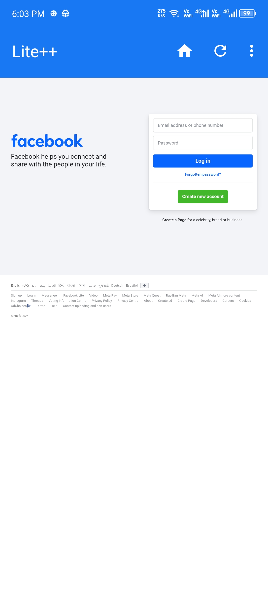
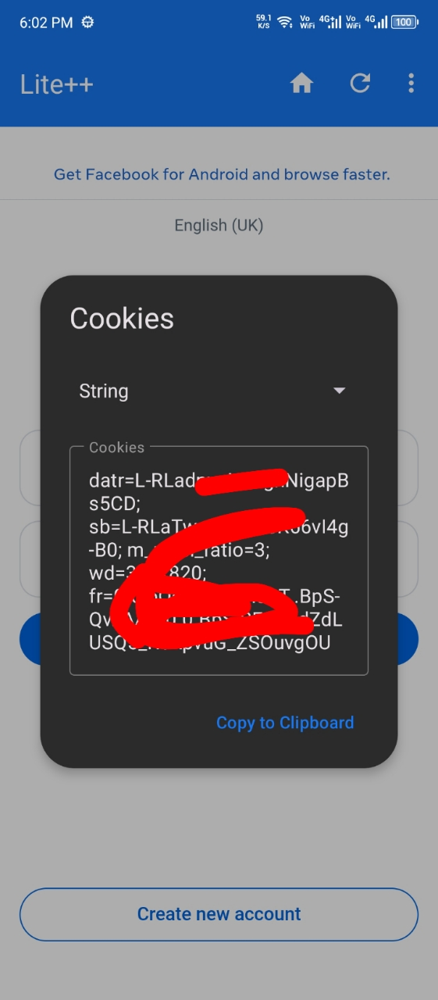

<div align="center">
  
  <h1>Lite++</h1>

  <p>
    <a href="https://github.com/farhaanaliii/Lite/releases">
      
    </a>
    <a href="https://github.com/farhaanaliii/Lite/stargazers">
      
    </a>
    <a href="LICENSE">
      
    </a>
  </p>

  <p><em>A lightweight and efficient browser wrapper built exclusively for Facebook.</em></p>
</div>

<br/>
<div align="center">
  <a href="https://github.com/Safouene1/support-palestine-banner/blob/master/Markdown-pages/Support.md">
    
  </a>
</div>

> [!CAUTION]
> Free and Open-Source Android is under threat. Google will turn Android into a locked-down platform, restricting your essential freedom to install apps of your choice. Make your voice heard – [keepandroidopen.org](https://keepandroidopen.org/).

Lite++ is a lightweight Android browser wrapper for Facebook with built-in cookie tools and desktop mode.

## Features

- Desktop mode toggle
- Cookie extraction (String, Netscape, JSON) and editing
- Custom User-Agent configuration
- Dark, light, and system theme support

## Installation

1. Download the latest APK from the [Releases](https://github.com/farhaanaliii/Lite/releases) page.
2. Install the APK on your Android device.
3. Launch Lite++ and log in to Facebook.

## Screenshots

<p align="center">
  
  
</p>

## Building from Source

### Requirements

- Android Studio Ladybug (or newer)
- JDK 17
- Android SDK (API 34+)

### Steps

1. Clone the repository:
   ```sh
   git clone https://github.com/farhaanaliii/Lite.git
   ```
2. Open Android Studio and select **Open**.
3. Select the cloned repository root and allow Gradle to sync dependencies.
4. Run the `app` configuration on an emulator or connected device.

## Contributing

Contributions, bug reports, and feature suggestions are welcome via issues and pull requests. See [CONTRIBUTING.md](CONTRIBUTING.md) for guidelines.

## License

Lite++ is open-source software licensed under the [MIT License](LICENSE).

---

Maintained by [Farhan Ali](https://github.com/farhaanaliii)
